# Offline Armenia Map Stack

A fully self-hosted, offline-capable mapping platform for Armenia built on Docker. Provides raster tiles, geocoding, reverse geocoding, and routing — all **fully autonomous** with automatic data updates from OpenStreetMap. No manual intervention required: when OSM data changes, every service updates itself with zero downtime. Designed for mission-critical applications including the **112 emergency call system**.

---

## Table of Contents

- [Architecture Overview](#architecture-overview)
- [Services](#services)
- [Prerequisites](#prerequisites)
- [Quick Start](#quick-start)
- [Configuration](#configuration)
- [Directory Layout](#directory-layout)
- [API Reference](#api-reference)
- [Test App](#test-app)
- [Autonomous Update Chain](#autonomous-update-chain)
- [Status & CLI](#status--cli)
- [Update Flow & Data Freshness](#update-flow--data-freshness)
- [Zero-Downtime Design](#zero-downtime-design)
- [Health Checks](#health-checks)
- [Operations & Maintenance](#operations--maintenance)
- [Monitoring (Zabbix)](#monitoring-zabbix)
- [NGINX Architecture (Two-Layer Design)](#nginx-architecture-two-layer-design)
- [Production Deployment (Domain & SSL)](#production-deployment-domain--ssl)
- [Troubleshooting](#troubleshooting)

---

## Architecture Overview

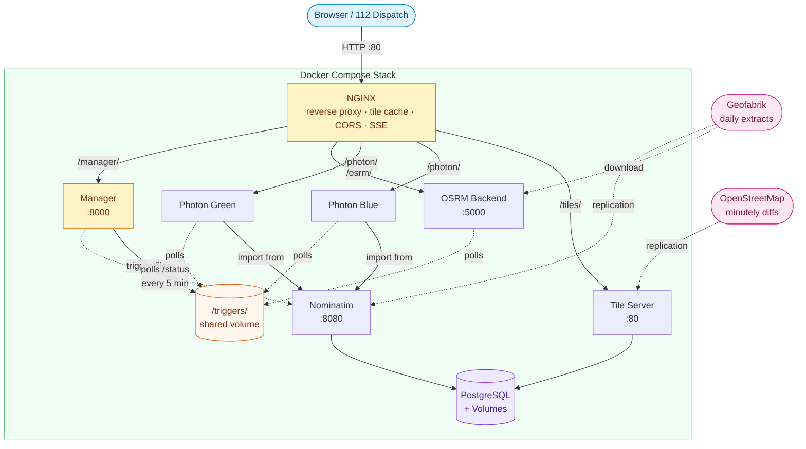

**7 containers**, **10 named volumes**, fully orchestrated via Docker Compose.

---

## Services

| Service | Image / Build | Purpose | Port | Update Mechanism |
|---------|--------------|---------|------|-----------------|
| **tile-server** | `ghcr.io/overv/openstreetmap-tile-server` | Raster tile rendering (z/x/y PNG) | — | Automatic minutely diffs from OSM |
| **nominatim** | `mediagis/nominatim:4.5` | Geocoding database (PostgreSQL + address index) | — | Automatic Geofabrik replication |
| **photon-blue** | `./services/photon` | Geocoding search API (instance 1 of 2) | — | Automatic (data-change monitor) |
| **photon-green** | `./services/photon` | Geocoding search API (instance 2 of 2) | — | Automatic (data-change monitor) |
| **osrm** | `./services/osrm` | Routing engine (driving directions) | — | Automatic (data-change monitor) |
| **manager** | `./services/manager` | Update orchestration + data-change monitor | — | N/A (orchestrator) |
| **nginx** | `nginx:1.27-alpine` (pinned by digest) | Reverse proxy, tile cache, rate limiting, load balancer | **80** | N/A (proxy) |

---

## Prerequisites

- **Docker Engine** >= 24 with **Docker Compose** plugin >= 2.20
- **25 GB** free disk space (imports, caches, update history)
- **12 GB** RAM recommended (tile rendering + Nominatim/Photon imports)
- Internet access for initial data download and OSM replication

---

## Quick Start

```bash
# 1. Clone and configure
git clone <repo-url>
cd offline-armenia-map
cp .env.example .env         # edit .env for production (passwords, tokens)
docker compose up -d --build

# 2. Wait for initial imports (~40 min on first boot for tile server)
#    Search + routing ready in ~1 min; tiles take longer (water polygon download)
docker compose ps          # watch for "healthy" status
docker compose logs -f     # monitor import progress

# 3. Open the test app
open http://localhost/      # or http://127.0.0.1/

# 4. Verify APIs
curl http://localhost/health
curl "http://localhost/photon/api?q=Yerevan&limit=3"
curl "http://localhost/osrm/nearest/v1/driving/44.51,40.18"
```

### Boot Sequence

| Minute | Event |
|--------|-------|
| 0:00 | Nominatim + Tile Server start importing |
| ~3:00 | Nominatim healthy → Manager starts, begins monitoring |
| ~4:00 | Manager healthy → Photon Blue + Green + OSRM start |
| ~4:30 | OSRM: PBF downloaded from Geofabrik |
| ~5:00 | OSRM: extract + load complete, **routing available** |
| ~5:00 | Photon Blue: import complete, **search available** |
| ~5:30 | Photon Green: import complete, both instances serving |
| ~40:00 | Tile Server: water polygon download + import complete, **tiles available** |

> **Search + routing available in ~5 minutes.** Tile rendering takes ~40 minutes on first boot (water polygon download). Subsequent starts skip all imports (data persisted in Docker volumes) and all services are ready in under 1 minute.

---

## Configuration

Copy `.env.example` to `.env` and adjust for your environment. The `.env` file is gitignored to prevent credential leaks:

| Variable | Default | Description |
|----------|---------|-------------|
| `OSM_PBF_URL` | `https://download.geofabrik.de/asia/armenia-latest.osm.pbf` | OSM data extract URL |
| `OSM_POLY_URL` | `https://download.geofabrik.de/asia/armenia.poly` | Polygon boundary for tile server |
| `DATA_UPDATE_INTERVAL` | `86400` | OSRM scheduled update interval (seconds) |
| `OSRM_PROFILE` | `car` | Routing profile (`car`, `bike`, `foot`) |
| `OSRM_MAX_MATCHING_SIZE` | `100` | Max coordinates for map matching |
| `OSRM_MAX_TABLE_SIZE` | `1000` | Max coordinates for distance matrix |
| `NOMINATIM_PASSWORD` | `CHANGE_ME_BEFORE_FIRST_DEPLOY` | Nominatim PostgreSQL password — **change before first deploy** |
| `PHOTON_LANGUAGES` | `hy` | Languages for geocoding index |
| `PHOTON_COUNTRY_CODES` | `am` | Countries to import |
| `UPDATE_TOKEN` | *(empty)* | Bearer token for manager API authentication (recommended for production) |
| `RATE_LIMIT_SECONDS` | `60` | Minimum seconds between update requests per service |
| `POLL_INTERVAL` | `30` | Trigger polling interval for OSRM and Photon (seconds) |
| `NOMINATIM_AUTO_UPDATE` | `enabled` | Auto-trigger Photon + OSRM when Nominatim data changes |
| `NOMINATIM_POLL_INTERVAL` | `300` | How often (seconds) to poll Nominatim `/status` for data changes |
| `PHOTON_IMPORT_HEAP` | `1g` | JVM heap for Photon import phase |
| `PHOTON_SERVE_HEAP` | `512m` | JVM heap for Photon serve phase |
| `PHOTON_AUTO_UPDATE_COOLDOWN` | `3600` | Minimum seconds between auto-triggered Photon updates |
| `OSRM_AUTO_UPDATE_COOLDOWN` | `3600` | Minimum seconds between auto-triggered OSRM updates |

---

## Directory Layout

```
offline-armenia-map/
├── .env.example                      # Configuration template (copy to .env)
├── .gitignore                        # Git ignore rules
├── docker-compose.yml                # Service orchestration (7 services, 10 volumes)
├── update.sh                         # CLI for status checks and manual triggers
├── README.md                         # This documentation
├── monitoring/
│   └── zabbix/
│       └── zbx_template_offline_map.yaml  # Zabbix 6.4+ importable template
├── test-app/
│   ├── index.html                    # Single-file MapLibre test app
│   └── icons/                        # 230 OSM Carto SVG POI icons (CC0)
└── services/
    ├── manager/
    │   ├── Dockerfile                # Python 3.13 Alpine (digest-pinned)
    │   ├── entrypoint.sh             # Fix volume perms as root, then drop to non-root via su-exec
    │   └── manager.py                # Update orchestration + data-change monitor + Prometheus metrics
    ├── photon/
    │   ├── Dockerfile                # Java 21 JRE + Photon 1.0.1 (digest-pinned)
    │   └── entrypoint.sh             # Import, serve, trigger polling
    ├── osrm/
    │   ├── Dockerfile                # OSRM v5.25.0 backend + curl + jq (digest-pinned)
    │   └── entrypoint.sh             # Download, prepare, shared-memory serve
    └── nginx/
        └── nginx.conf                # Reverse proxy + tile cache + blue-green upstream
```

---

## API Reference

All APIs are served through nginx on port **80**. CORS headers (`Access-Control-Allow-Origin: *`) are included on every response.

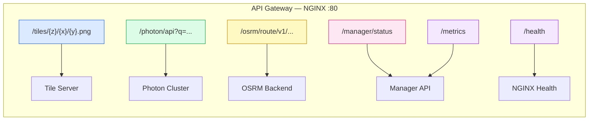

### Tiles

```
GET /tiles/{z}/{x}/{y}.png
```
Raster map tiles in web Mercator projection. Cached by nginx for 5 minutes.

Response header `X-Cache-Status` indicates cache state: `HIT`, `MISS`, or `STALE`.

### Geocoding (Photon)

```
GET /photon/api?q={query}&limit={n}&lang={lang}
```
Forward geocoding with autocomplete. Returns GeoJSON FeatureCollection.

```
GET /photon/reverse?lon={lon}&lat={lat}
```
Reverse geocoding. Returns the nearest address for given coordinates.

Load-balanced across two instances via nginx upstream with automatic failover.

### Routing (OSRM)

```
GET /osrm/route/v1/driving/{lon1},{lat1};{lon2},{lat2}?overview=full&geometries=geojson
```
Driving route with turn-by-turn instructions. Supports `steps=true` for maneuver details.

```
GET /osrm/nearest/v1/driving/{lon},{lat}
```
Snap coordinates to the nearest road segment.

```
GET /osrm/table/v1/driving/{coords}
```
Distance/duration matrix between multiple points.

### Manager API

```
GET  /manager/status     # JSON status of all services
POST /manager/update     # Trigger manual update (ops use)
GET  /manager/progress   # SSE stream of real-time status changes
GET  /metrics            # Prometheus exposition format metrics
```

**POST /manager/update** body:
```json
{"services": ["osrm", "photon"], "source": "web"}
```
Use `"services": ["all"]` to trigger all updatable services. For Photon, this initiates a rolling blue-green update.

If `UPDATE_TOKEN` is configured, include the `Authorization` header:
```
Authorization: Bearer <your-token>
```

Requests are rate-limited per service (default: 60s cooldown between triggers). Rate limit state is persisted to the triggers volume and survives manager restarts. Concurrent update requests are serialized to prevent double-triggering.

### Prometheus Metrics

```
GET /metrics
```

Exposes metrics in Prometheus text exposition format (`text/plain; version=0.0.4`). Restricted to localhost and private networks (`127.0.0.0/8`, `10.0.0.0/8`, `172.16.0.0/12`, `192.168.0.0/16`) via nginx — not accessible from the public internet. Available metrics:

| Metric | Type | Description |
|--------|------|-------------|
| `manager_up` | gauge | Manager process is up (always 1) |
| `manager_http_requests_total` | counter | Total HTTP requests by method and path |
| `manager_updates_triggered_total` | counter | Total updates triggered by service |
| `manager_updates_skipped_total` | counter | Total updates skipped by service and reason |
| `manager_rate_limit_rejections_total` | counter | Rate limit rejections by service |
| `manager_sse_connections_current` | gauge | Current SSE connections |
| `manager_sse_connections_total` | counter | Total SSE connections opened |
| `manager_update_errors_total` | counter | Update errors by service |
| `manager_service_up` | gauge | Service state: 1=idle/auto, 0.5=updating, 0=error |
| `manager_data_change_monitor_enabled` | gauge | Nominatim data-change monitor is enabled (1) |
| `manager_auto_trigger_timestamp_seconds` | gauge | Last auto-trigger Unix timestamp by service (photon, osrm) |

Example Prometheus scrape config:
```yaml
scrape_configs:
  - job_name: 'armenia-map-manager'
    static_configs:
      - targets: ['localhost:80']
    metrics_path: '/metrics'
    scrape_interval: 15s
```

### Health Check Endpoints (per-instance)

```
GET /photon-blue/api?q=test     # Direct to blue instance
GET /photon-green/api?q=test    # Direct to green instance
GET /health                     # Stack-level health
```

---

## Test App

The built-in web app at `http://localhost/` provides a full-featured mapping interface:

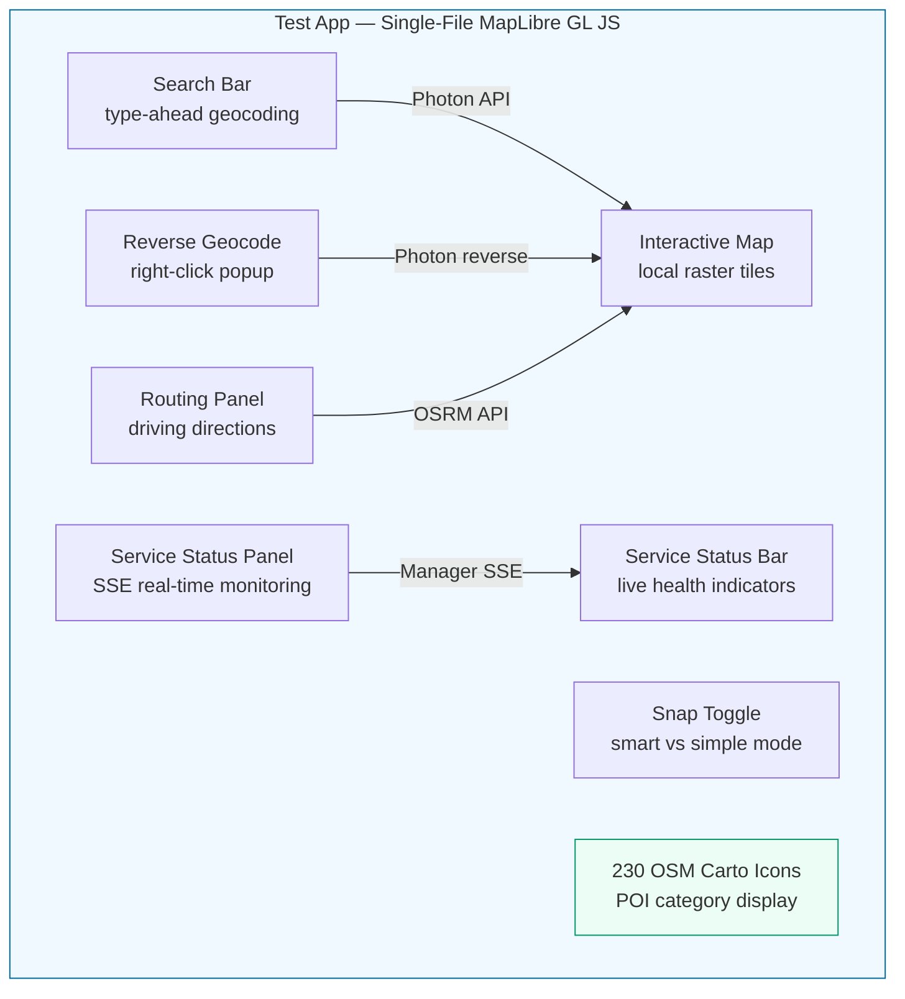

### Features

| Feature | Description |
|---------|-------------|
| **Interactive map** | Full-screen MapLibre GL JS with local raster tiles (auto-fallback to OSM CDN during import) |
| **Search** | Type-ahead geocoding with debounced autocomplete, keyboard navigation, 230 OSM Carto POI icons, category badges |
| **Reverse geocoding** | Right-click any point — two modes via **Snap toggle**: smart snap-to-nearest-object with distance visualization, or simple point lookup |
| **Routing** | Click two points for driving directions with turn-by-turn steps, draggable waypoint markers, dashed connector lines |
| **Route address inputs** | Text fields for start/end with geocoding autocomplete |
| **POI icons** | 230 SVG icons from [OpenStreetMap Carto](https://github.com/gravitystorm/openstreetmap-carto) (CC0) — matches the rendered map style. Covers amenities, shops, tourism, historic, leisure, transport, nature, and more |
| **Layer switcher** | Toggle between local and OSM CDN tiles |
| **Fullscreen mode** | Dedicated button for distraction-free viewing |
| **Map persistence** | Position and zoom level preserved across page refreshes via localStorage |
| **Service status panel** | Read-only monitor with per-instance blue/green health, last updated timestamps, next scheduled check countdowns, live health probes with latency, auto-update monitor state. Updated in real-time via SSE |
| **Service status bar** | Live health indicators for all services (tiles, photon-blue, photon-green, OSRM, manager) |
| **Help overlay** | Keyboard shortcuts and feature guide |

### Snap vs Simple Reverse Geocoding

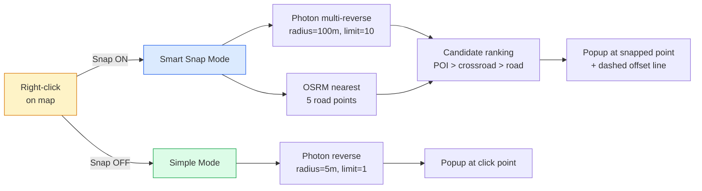

### Keyboard Shortcuts

| Key | Action |
|-----|--------|
| `/` or `Ctrl+K` | Focus search |
| `Escape` | Clear search / close panels |
| `R` | Toggle routing mode |
| `S` | Toggle snap mode |
| `F` | Toggle fullscreen |
| `?` | Show help overlay |

### Icon Coverage

All icons are sourced from [OpenStreetMap Carto](https://github.com/gravitystorm/openstreetmap-carto) symbols (CC0 license) for visual consistency with the rendered map tiles:

| Category | Examples | Count |
|----------|----------|-------|
| **Amenity** | restaurant, cafe, hospital, pharmacy, bank, fuel, parking, police, library, cinema | 66 |
| **Shop** | supermarket, bakery, clothes, electronics, furniture, copyshop, hairdresser, car_repair | 71 |
| **Tourism** | hotel, museum, viewpoint, hostel, campsite, artwork | 20 |
| **Historic** | monument, castle, palace, fortress, statue, archaeological_site | 15 |
| **Leisure** | playground, fitness, golf, bowling, water_park, sauna, fishing | 16 |
| **Man-made** | lighthouse, windmill, water_tower, observation_tower, crane | 16 |
| **Natural** | peak, cave, spring, waterfall, saddle | 5 |
| **Religion** | christian, muslim, jewish, buddhist, hindu, shinto, sikh, taoist | 8 |
| **Other** | bus_stop, embassy, toll_booth, gate, elevator | 13 |
| | | **230 total** |

---

## Autonomous Update Chain

Every service in the stack updates automatically — no cron jobs, no manual triggers, no operator intervention required.

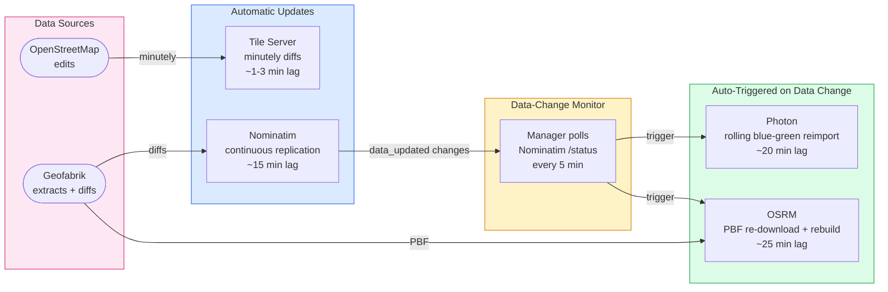

### How It Works

1. **Tile Server** and **Nominatim** have built-in replication — they pull updates directly from upstream sources
2. The **Manager** runs a background **data-change monitor** that polls Nominatim's `/status` endpoint every 5 minutes
3. When Nominatim's `data_updated` timestamp changes (new replication diffs applied), the manager automatically:
   - Triggers a **Photon rolling update** (blue-green, zero downtime)
   - Triggers an **OSRM update** (PBF re-download with `If-Modified-Since`, only rebuilds if data changed)
4. Each service has an independent **cooldown** (default 1 hour) to prevent rapid re-triggers

### Autonomous Update Summary

| Service | Source | Trigger | Latency | Downtime |
|---------|--------|---------|---------|----------|
| **Tile Server** | OSM minutely diffs | Built-in replication | ~1-3 min | 0 ms |
| **Nominatim** | Geofabrik replication diffs | Built-in replication | ~15 min | 0 ms |
| **Photon** | Nominatim database | Data-change monitor → rolling update | ~20 min | 0 ms |
| **OSRM** | Geofabrik PBF extract | Data-change monitor → re-download | ~25 min | 0 ms |

### Fallbacks

The autonomous system has multiple safety layers:

- **OSRM backup polling**: Independent 24-hour scheduled cycle (`DATA_UPDATE_INTERVAL`) as belt-and-suspenders
- **Ops CLI**: `POST /manager/update` and `./update.sh` available for immediate triggers when needed
- **Cooldown protection**: Prevents rapid re-triggers when Nominatim applies many small diffs
- **Blue-green safety**: Never takes both Photon instances down simultaneously (30-minute timeout guard)
- **OSRM `If-Modified-Since`**: Avoids unnecessary rebuilds when PBF hasn't changed yet

---

## Status & CLI

### Status Monitoring (Web UI)

Click the refresh button (&#8635;) in the map controls to open the **Service Status** panel. It shows real-time status for all services including last update timestamps, next scheduled check countdowns, Photon blue/green instance health, live health probes with latency, and the auto-update monitor state. The panel is read-only — all updates are fully autonomous.

### CLI Tools

```bash
# Check status of all services
./update.sh status

# Trigger specific service
./update.sh osrm
./update.sh photon

# Trigger all updatable services
./update.sh all

# Follow progress in real-time
./update.sh all --follow

# With authentication (if UPDATE_TOKEN is configured)
UPDATE_TOKEN=my-secret-token ./update.sh all --follow
```

### Manager API

```bash
# Trigger OSRM update
curl -X POST http://localhost/manager/update \
  -H "Content-Type: application/json" \
  -d '{"services": ["osrm"], "source": "cli"}'

# Stream progress via SSE
curl -N http://localhost/manager/progress
```

### How Triggers Work

Triggers can be created by the **data-change monitor** (automatic) or by **manual API requests**:

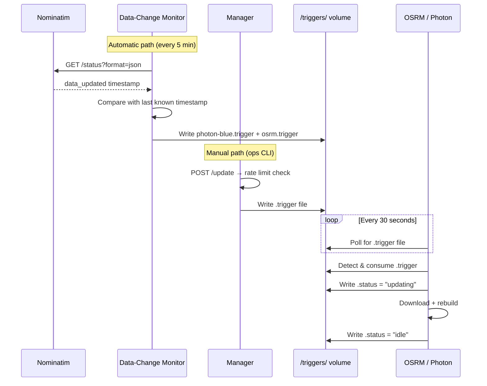

No Docker socket access required. Each service self-manages its own updates.

---

## Update Flow & Data Freshness

| Service | Data Source | Update Frequency | Lag Behind OSM |
|---------|-----------|-----------------|----------------|
| **Tile Server** | OSM minutely diffs (planet.openstreetmap.org) | Automatic, every minute | **~1-3 minutes** |
| **Nominatim** | Geofabrik Armenia updates | Automatic, continuous replication | **~15 minutes** |
| **Photon** | Reimport from local Nominatim | Automatic (data-change monitor) | **~20 minutes** |
| **OSRM** | Geofabrik Armenia PBF extract | Automatic (data-change monitor) | **~25 minutes** |

### Tile Server Replication

The tile server initially uses hourly replication from OSM. On first run, the entrypoint automatically **switches to minutely replication** by:

1. Reading the current hourly sequence number from the state file
2. Fetching the current minutely sequence from planet.openstreetmap.org
3. Calculating the equivalent minutely sequence number via timestamp offset
4. Updating the osmosis configuration and state files

This ensures map tiles reflect OSM edits within 1-2 minutes. The nginx tile cache TTL is set to 5 minutes, and browser cache to 5 minutes, so users see fresh tiles promptly.

### Tile Invalidation (Selective Expiry)

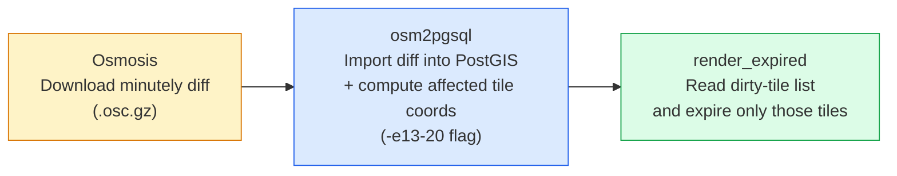

| Zoom Level | Action | Behavior |
|---|---|---|
| **13–18** | Mark dirty (touch) | Metatile timestamp updated; renderd re-renders on next request |
| **19–20** | Delete | Tile file removed from disk; re-rendered on demand |
| **0–12** | Not expired | Changes typically invisible at low zoom; tiles remain cached |

For a single-feature edit (e.g., a building in Yerevan), this typically expires **20–50 tiles** out of potentially millions — making the process very efficient. The `render_expired` thresholds are configurable via environment variables:

| Variable | Default | Description |
|---|---|---|
| `EXPIRY_MINZOOM` | `13` | Lowest zoom level to expire |
| `EXPIRY_TOUCHFROM` | `13` | Zoom level from which to mark tiles dirty |
| `EXPIRY_DELETEFROM` | `19` | Zoom level from which to delete tiles outright |
| `EXPIRY_MAXZOOM` | `20` | Highest zoom level to expire |

### OSRM Update Cycle

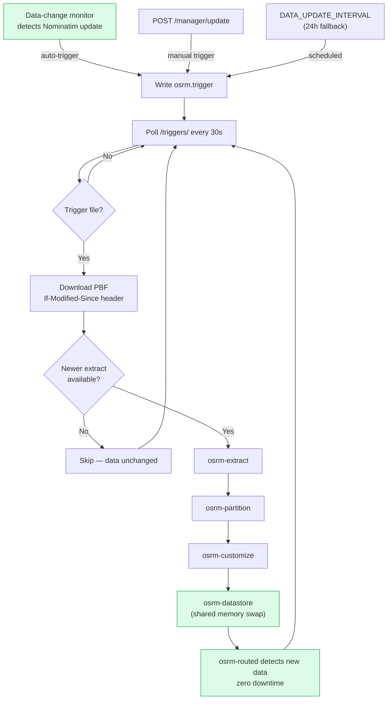

### Photon Rolling Update

Triggered automatically by the data-change monitor or manually via the API:

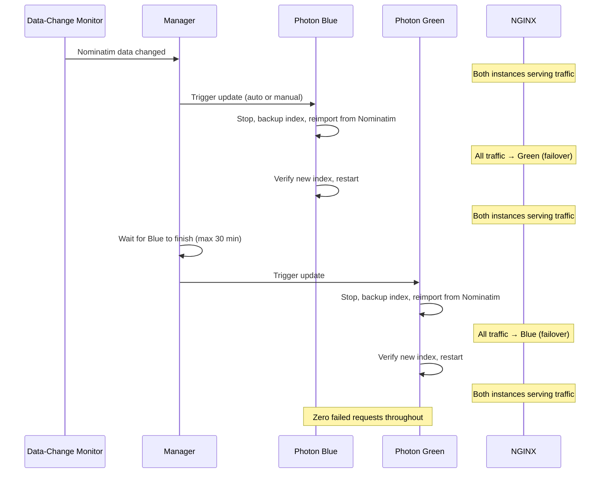

---

## Zero-Downtime Design

This stack is designed for the **112 emergency call system** with zero-downtime requirements:

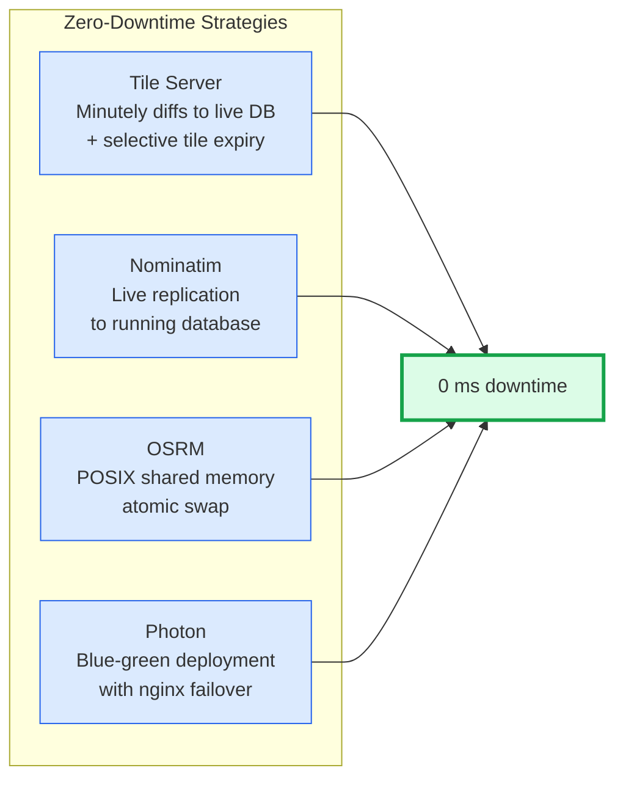

| Service | Strategy | Downtime During Update |
|---------|----------|----------------------|
| **Tile Server** | Minutely diffs applied to live PostgreSQL; selective tile expiry (only affected tiles at z13–20) | **0 ms** |
| **Nominatim** | Live replication to running database | **0 ms** |
| **OSRM** | POSIX shared memory atomic swap (`osrm-datastore`) | **0 ms** |
| **Photon** | Blue-green deployment with nginx failover | **0 ms** (per-request) |

### Photon Blue-Green Architecture

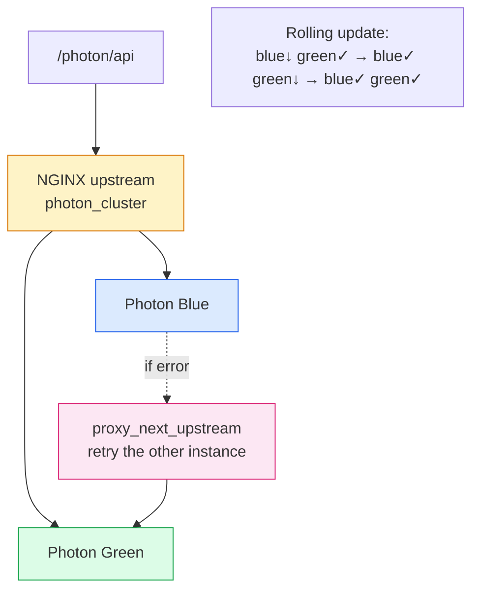

nginx configuration:
- `upstream photon_cluster` with both instances
- `proxy_next_upstream error timeout http_502 http_503` — automatic retry on the healthy instance
- `max_fails=2 fail_timeout=5s` — mark instance as failed after 2 errors
- `proxy_connect_timeout 2s` — fast failure detection

### NGINX Tile Cache

- **Proxy cache**: 2 GB, 7-day retention, serves stale on backend errors
- **Cache TTL**: 5 minutes for successful responses, 1 minute for 404s
- **Stale serving**: `proxy_cache_use_stale error timeout updating http_500 http_502 http_503 http_504`
- **Cache lock**: Prevents thundering herd on cache misses

---

## Health Checks

All services include Docker health checks. Monitor with `docker compose ps`.

| Service | Health Check | Interval | Start Period |
|---------|-------------|----------|-------------|
| tile-server | Render zoom-0 tile | 30s | 40 min |
| nominatim | Status endpoint (`/status?format=json`) | 30s | 10 min |
| photon-blue | Geocoding API query | 15s | 10 min |
| photon-green | Geocoding API query | 15s | 10 min |
| osrm | Nearest-point API | 15s | 5 min |
| manager | Status API | 15s | 10s |
| nginx | `/health` endpoint | 10s | 10s |

---

## Operations & Maintenance

### Logs

```bash
docker compose logs -f                    # All services
docker compose logs -f tile-server        # Specific service
docker compose logs -f photon-blue photon-green  # Both Photon instances
```

### Service Status

```bash
docker compose ps                         # Container health
curl http://localhost/manager/status       # Detailed service status with update info
./update.sh status                        # CLI status
```

### Volume Management

```bash
docker volume ls | grep offline-armenia   # List all volumes
docker compose down                       # Stop without data loss
docker compose down -v                    # Stop and purge ALL data (full reimport needed)
```

Named volumes:
| Volume | Content | Size Estimate |
|--------|---------|---------------|
| `tiles-db` | PostgreSQL with rendered tile data | ~8 GB |
| `tiles-cache` | Renderd pre-rendered tile cache | ~2 GB |
| `tiles-data` | Import state and external data | ~1 GB |
| `nominatim-data` | Nominatim PostgreSQL database | ~3 GB |
| `photon-data-blue` | Photon search index (blue) | ~200 MB |
| `photon-data-green` | Photon search index (green) | ~200 MB |
| `osrm-data` | OSRM prepared routing data | ~500 MB |
| `osm-downloads` | Downloaded PBF extracts | ~200 MB |
| `nginx-cache` | Nginx tile proxy cache | Up to 2 GB |
| `update-triggers` | Trigger and status files | < 1 MB |

### Cache Management

```bash
# Clear nginx tile cache (forces re-fetch from tile server)
docker compose exec nginx sh -c "rm -rf /var/cache/nginx/tiles/*"

# Clear renderd tile cache (forces re-render)
docker compose exec tile-server bash -c "rm -rf /var/cache/renderd/tiles/default/*"

# Both caches + browser: clear caches then Cmd+Shift+R in browser
```

### Updating the Stack

```bash
docker compose pull              # Pull latest upstream images
docker compose up -d --build     # Rebuild custom services
```

Persistent volumes preserve all indexed data across upgrades.

---

## Monitoring (Zabbix)

A ready-to-import Zabbix template is provided at `monitoring/zabbix/zbx_template_offline_map.yaml`.

### Setup

1. Import the template in Zabbix: **Data collection → Templates → Import** → select the YAML file
2. Create a host for the map stack server
3. Link the **Offline Armenia Map Stack** template to the host
4. Set the `{$MAP_BASE_URL}` macro to the stack's address (e.g., `http://10.0.0.5`)

> **Network requirement**: The Zabbix server/proxy must be on an RFC 1918 network reachable by the stack's nginx, since `/metrics` is restricted to private IPs.

### Template Macros

| Macro | Default | Description |
|-------|---------|-------------|
| `{$MAP_BASE_URL}` | `http://localhost` | Stack base URL |
| `{$MAP_STATUS_INTERVAL}` | `30s` | Poll interval for `/manager/status` |
| `{$MAP_METRICS_INTERVAL}` | `60s` | Poll interval for `/metrics` |
| `{$MAP_HEALTH_INTERVAL}` | `30s` | Poll interval for `/health` |
| `{$MAP_STALE_UPDATE_HOURS}` | `48` | Stale-data alert threshold (hours) |
| `{$MAP_HTTP_TIMEOUT}` | `10s` | HTTP request timeout |

### What's Monitored

**3 master HTTP agent items** poll the stack — all dependent items are parsed from these without extra HTTP requests:

| Source | Endpoint | Items Parsed |
|--------|----------|-------------|
| Manager Status | `GET /manager/status` | Service states, last update times, trigger status, messages |
| Prometheus Metrics | `GET /metrics` | Counters (HTTP requests, updates, errors, rate limits), gauges (SSE connections, service up) |
| Health Check | `GET /health` | NGINX liveness |

### Triggers

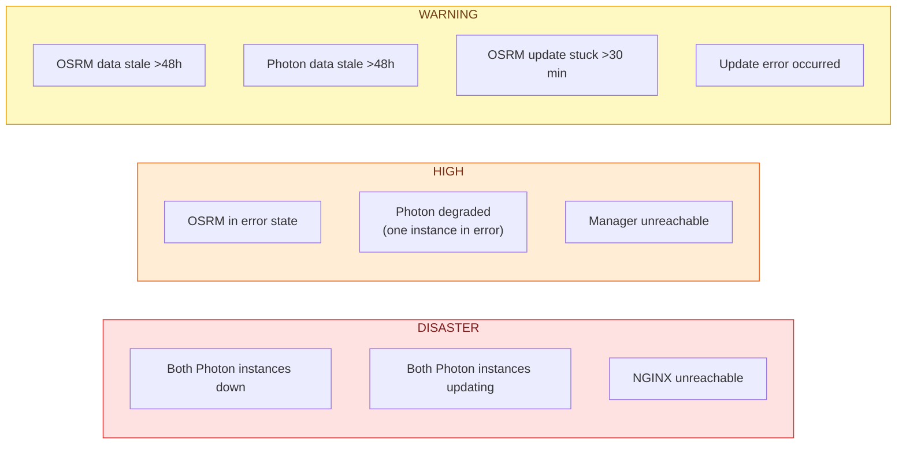

### Dashboard

The template includes a built-in **Map Stack Overview** dashboard with service state panels and service-up gauge graphs.

---

## NGINX Architecture (Two-Layer Design)

In production, this stack uses **two nginx instances** — one inside Docker (the API gateway) and one on the host (the SSL reverse proxy). Each handles a distinct layer of concerns:

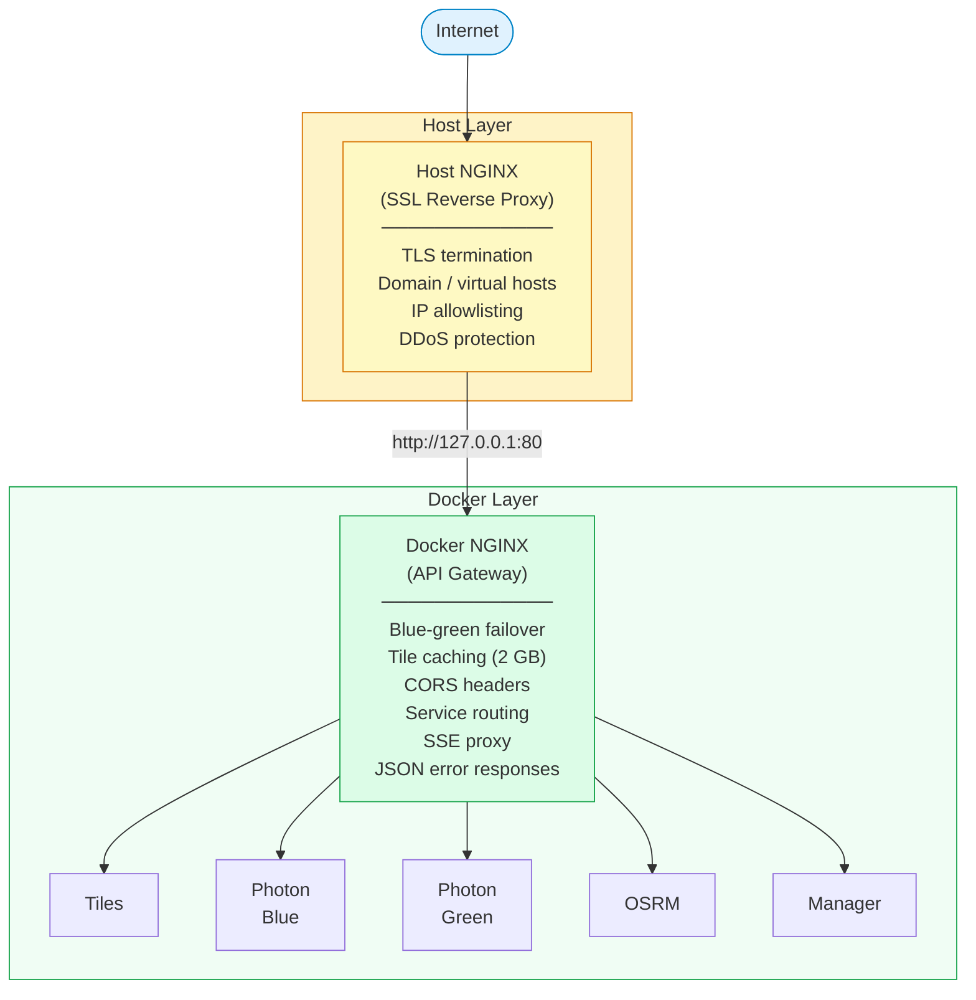

### Why the Docker NGINX Can't Be Removed

| Function | What It Does | Why Host NGINX Can't Replace It |
|----------|-------------|-------------------------------|
| **Blue-green failover** | `upstream photon_cluster` with `proxy_next_upstream` retries the other instance on error | Host nginx cannot resolve Docker-internal hostnames (`photon-blue`, `photon-green`) without exposing ports and losing container isolation |
| **Tile cache** | 2 GB `proxy_cache_path` with stale-serving on backend errors | Requires direct access to `tile-server:80` inside the Docker network |
| **Single entry point** | Routes `/tiles/`, `/photon/`, `/osrm/`, `/manager/`, `/` to 5 different backends | Without it, you'd expose 5 separate ports in `docker-compose.yml` and configure them all in the host nginx |
| **SSE buffering** | `proxy_buffering off` for `/manager/progress` event stream | Per-location buffering config is tied to the application routing |
| **CORS + security headers** | Consistent `Access-Control-Allow-Origin`, `X-Frame-Options`, `X-Content-Type-Options` on every response | Would need to duplicate across 5+ location blocks in host nginx |
| **Error handling** | `error_page 502 503 504` → JSON response with `Retry-After` header | Application-specific error format that belongs with the app |

### The Benefit of Separation

- **Portability**: `docker compose up` works identically on any server. Move the whole stack by copying the directory — only reconfigure the host nginx for the new domain/certs.
- **Independence**: Update SSL certs, add IP restrictions, or change domains without touching the Docker stack. Update the Docker stack without touching SSL config.
- **Development**: Locally, `http://localhost` works with no SSL setup. In production, the host nginx adds SSL transparently.

---

## Production Deployment (Domain & SSL)

### Prerequisites

- A server with a public IP and a domain name (e.g., `map.example.am`)
- DNS A record pointing `map.example.am` to the server IP
- The Docker stack running on `127.0.0.1:80` (default configuration)

### 1. Install Host NGINX and Certbot

```bash
# Debian/Ubuntu
sudo apt update
sudo apt install -y nginx certbot python3-certbot-nginx

# Enable and start nginx
sudo systemctl enable nginx
sudo systemctl start nginx
```

### 2. Create the NGINX Site Configuration

Create `/etc/nginx/sites-available/map.example.am`:

```nginx
# ─── HTTP → HTTPS redirect ───────────────────────────────────────────
server {
    listen 80;
    listen [::]:80;
    server_name map.example.am;

    # Certbot ACME challenge (needed for initial cert + renewals)
    location /.well-known/acme-challenge/ {
        root /var/www/certbot;
    }

    location / {
        return 301 https://$host$request_uri;
    }
}

# ─── HTTPS reverse proxy to Docker stack ──────────────────────────────
server {
    listen 443 ssl http2;
    listen [::]:443 ssl http2;
    server_name map.example.am;

    # SSL certificates (managed by certbot)
    ssl_certificate     /etc/letsencrypt/live/map.example.am/fullchain.pem;
    ssl_certificate_key /etc/letsencrypt/live/map.example.am/privkey.pem;

    # Modern TLS settings
    ssl_protocols TLSv1.2 TLSv1.3;
    ssl_ciphers ECDHE-ECDSA-AES128-GCM-SHA256:ECDHE-RSA-AES128-GCM-SHA256:ECDHE-ECDSA-AES256-GCM-SHA384:ECDHE-RSA-AES256-GCM-SHA384;
    ssl_prefer_server_ciphers off;
    ssl_session_timeout 1d;
    ssl_session_cache shared:SSL:10m;
    ssl_session_tickets off;

    # HSTS — tell browsers to always use HTTPS (1 year)
    add_header Strict-Transport-Security "max-age=31536000; includeSubDomains" always;

    # ── Proxy to Docker stack on localhost:80 ──
    # IMPORTANT: Do NOT add Access-Control-Allow-Origin or other CORS headers here.
    # The Docker-internal nginx already sets CORS headers on all responses.
    # Adding them here causes duplicate header values ("*, *") which browsers reject.
    location / {
        proxy_pass http://127.0.0.1:80;

        proxy_http_version 1.1;
        proxy_set_header Host $host;
        proxy_set_header X-Real-IP $remote_addr;
        proxy_set_header X-Forwarded-For $proxy_add_x_forwarded_for;
        proxy_set_header X-Forwarded-Proto $scheme;

        # SSE support (for /manager/progress)
        proxy_buffering off;
        proxy_cache off;
        proxy_read_timeout 300s;
    }

    # ── Restrict /metrics to internal networks only ──
    location = /metrics {
        # Only allow access from trusted monitoring servers
        allow 127.0.0.1;
        # allow 10.0.0.0/8;       # Uncomment and adjust for your Zabbix/Prometheus server
        deny all;

        proxy_pass http://127.0.0.1:80;
        proxy_http_version 1.1;
        proxy_set_header Host $host;
        proxy_connect_timeout 5s;
        proxy_read_timeout 10s;
    }

    # ── Optional: restrict manager API to internal networks ──
    # Uncomment to prevent public access to update triggers
    # location /manager/ {
    #     allow 10.0.0.0/8;
    #     allow 172.16.0.0/12;
    #     allow 192.168.0.0/16;
    #     deny all;
    #
    #     proxy_pass http://127.0.0.1:80;
    #     proxy_http_version 1.1;
    #     proxy_set_header Host $host;
    #     proxy_set_header X-Real-IP $remote_addr;
    #     proxy_set_header X-Forwarded-For $proxy_add_x_forwarded_for;
    #     proxy_set_header X-Forwarded-Proto $scheme;
    #     proxy_buffering off;
    #     proxy_read_timeout 300s;
    # }
}
```

### 3. Enable the Site and Obtain SSL Certificate

```bash
# Enable the site
sudo ln -s /etc/nginx/sites-available/map.example.am /etc/nginx/sites-enabled/

# Remove default site (optional)
sudo rm -f /etc/nginx/sites-enabled/default

# Test configuration
sudo nginx -t

# Create ACME challenge directory
sudo mkdir -p /var/www/certbot

# Reload nginx (serves HTTP for ACME challenge)
sudo systemctl reload nginx

# Obtain certificate (interactive — enter email, agree to terms)
sudo certbot --nginx -d map.example.am

# Verify auto-renewal timer
sudo systemctl status certbot.timer
```

### 4. Verify the Setup

```bash
# HTTPS should work
curl -I https://map.example.am/health

# HTTP should redirect to HTTPS
curl -I http://map.example.am/health
# Expected: 301 → https://map.example.am/health

# API endpoints
curl "https://map.example.am/photon/api?q=Yerevan&limit=3"
curl "https://map.example.am/osrm/nearest/v1/driving/44.51,40.18"

# HSTS header present
curl -sI https://map.example.am/ | grep -i strict
# Expected: Strict-Transport-Security: max-age=31536000; includeSubDomains
```

### 5. Firewall Configuration

```bash
# Allow HTTP (for ACME) and HTTPS
sudo ufw allow 80/tcp
sudo ufw allow 443/tcp

# Block direct access to Docker debug ports (should already be localhost-only)
# Verify with: sudo ss -tlnp | grep -E '8080|5002'
# Both should show 127.0.0.1 only
```

### Production Checklist

- [ ] Set strong `NOMINATIM_PASSWORD` in `.env`
- [ ] Set `UPDATE_TOKEN` in `.env` to protect the manager API
- [ ] DNS A record points to the server
- [ ] SSL certificate obtained and auto-renewal verified (`sudo certbot renew --dry-run`)
- [ ] HSTS header present on HTTPS responses
- [ ] `/metrics` endpoint not accessible from the public internet
- [ ] `/manager/` endpoint restricted to internal networks (if not using token auth)
- [ ] Only nginx port 80 is exposed to the host (tile-server and OSRM are internal-only)
- [ ] Firewall allows only ports 80 and 443
- [ ] Zabbix/Prometheus monitoring configured and alerting
- [ ] Log rotation configured (`docker compose` default: 50 MB × 5 files per service)
- [ ] Backup strategy for volumes (at minimum: `nominatim-data`, `tiles-db`)

---

## Troubleshooting

### Tile server shows "import in progress"
First boot imports tiles, external data (water polygons ~917 MB, coastlines), and builds the rendering database. This takes ~30 minutes. Check progress:
```bash
docker compose logs -f tile-server
```

### Tiles not showing recent OSM edits
1. The tile server uses minutely diffs but tiles are cached at multiple layers
2. Clear caches: nginx (`rm -rf /var/cache/nginx/tiles/*`), renderd (`rm -rf /var/cache/renderd/tiles/default/*`)
3. Hard-refresh browser: `Cmd+Shift+R`
4. Verify replication state: `docker compose exec tile-server bash -c "cat /data/database/.osmosis/state.txt"`

### Photon returns empty results
Verify Nominatim finished importing, then check Photon logs:
```bash
docker compose logs nominatim | tail -20
docker compose logs photon-blue | tail -20
```

### OSRM returns "No newer extract available"
Geofabrik updates Armenia PBF once daily (~20:00 UTC). If you triggered an update shortly after the initial import, the extract hasn't changed yet.

### Manager shows as unhealthy
Check logs for startup errors:
```bash
docker compose logs manager
```

### Permission errors on `/triggers/`
The manager sets the trigger directory to mode `0777` on startup. Ensure the manager service starts before OSRM and Photon (`depends_on` in docker-compose.yml).

### OSRM shared memory errors
Increase `shm_size` in `docker-compose.yml` (default 2 GB):
```yaml
osrm:
  shm_size: '4g'
```

### NGINX returns 502/503/504
Check which backend is down:
```bash
docker compose ps
curl http://localhost/manager/status
```
NGINX starts immediately but proxied services may still be importing on first boot.

### CORS error: "Access-Control-Allow-Origin header contains multiple values"
This happens when both the host nginx and the Docker nginx add `Access-Control-Allow-Origin: *`, resulting in `*, *` which browsers reject. The Docker nginx already sets all CORS headers — **do not add CORS headers in your host nginx config**. Check your host nginx for any `add_header Access-Control-Allow-Origin` directives and remove them.

---

## Ports

| Port | Service | Access |
|------|---------|--------|
| **80** | nginx (all APIs + test app) | Primary entry point (`127.0.0.1` only) |

All backend services (tile-server, nominatim, photon, osrm, manager) are internal-only on the `map-internal` Docker network — no host ports exposed.

---

## Security Notes

- **Network isolation**: Dual Docker network — `map-internal` (no internet, inter-service only) and `map-egress` (outbound for tile-server, nominatim, osrm data downloads). Photon and manager have no outbound internet access.
- **Non-root containers**: Manager, OSRM, and Photon run as non-root users
- No Docker socket is exposed to any container
- Inter-service communication uses trigger files on a shared volume (mode `0777`, three UIDs)
- Status files are written atomically (tmp + rename) to prevent partial reads
- **CORS**: Wildcard `*` on public API endpoints (`/photon/`, `/osrm/`, `/tiles/`); `/manager/` location has no CORS headers (restricted to private networks)
- **CSP**: Content-Security-Policy header on the test app restricts scripts, styles, and connections to self + OSM tile CDN
- **nginx hardening**: `server_tokens off`, security headers on all locations, rate limiting (3 zones: api/tiles/manager), `/manager/` and `/metrics` restricted to RFC 1918 networks
- Nominatim password defaults to a placeholder — **must be changed before first deploy**
- **API authentication**: Set `UPDATE_TOKEN` in `.env` to protect the update endpoint with Bearer token auth (HMAC constant-time comparison)
- **Rate limiting**: Update requests are throttled per service (configurable via `RATE_LIMIT_SECONDS`), with thread-safe serialization to prevent double-triggering via concurrent requests
- **Input validation**: Manager API validates request body size, types, service names; source field sanitized to 64 alphanumeric chars; NOMINATIM_HOST validated against SSRF regex
- **Prometheus labels**: Fixed allowlist of known paths prevents cardinality-based resource exhaustion; label values escaped for exposition format
- All base images are pinned to SHA256 digests (`image@sha256:...`) including nginx; Photon JAR verified by SHA256 checksum
- Rate limit state is persisted to the triggers volume and restored on manager restart
- **Crash resilience**: Both OSRM and Photon have crash counters with 60s stability windows and circuit breakers (5 max restarts before container exit for Docker-level restart backoff)
